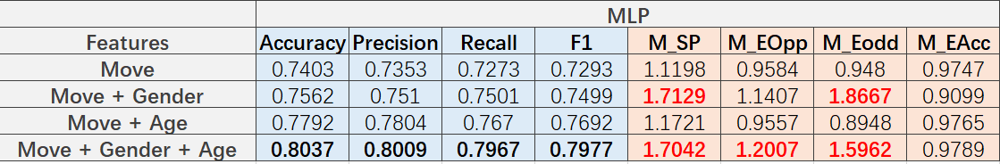
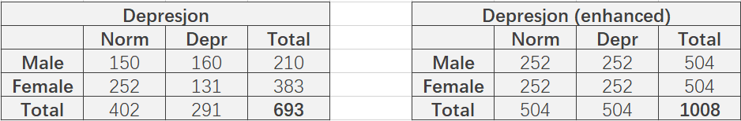
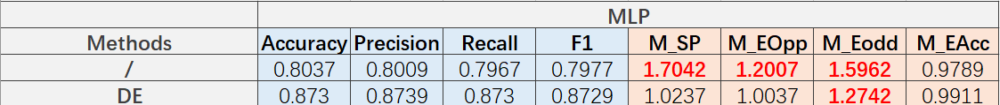
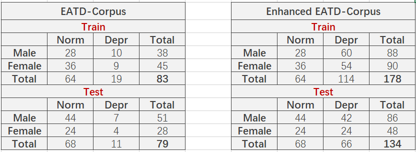
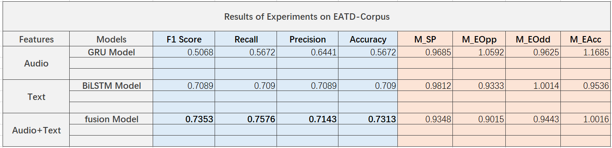
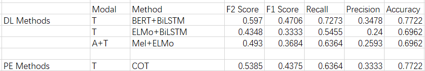

# Multimodal-Depression-Detection
This is the Codebase for Multimodal Depression Detection Project

### News

2023.5 - 2023.7	多模态抑郁检测文献调研

- 我们了解到在一些场景下性别信息可能会被检测模型错误使用，从而导致偏见问题。我们在一个简单的数据集Depresjon上进行了实验，发现性别偏见问题并不明显。
- 实验结果和分析在[这里](./Gender-Bias)可以找到。

2023.7 - 2023.9	文本+音频双模态抑郁检测

- 我们完成了基于GRU-BILSTM的模型复现。在此模型的基础上，我们在EATD-Corpus上发现并验证了双模态模型训练过程中存在弱势模态问题。
- 实验结果和分析在[这里](./Multimodal-Depression-Detection)可以找到。

2023.9 - 2023.11	LLM辅助文本模态抑郁检测

- 在此阶段，我们主要关注文本模态的抑郁检测，应用Prompt-Engineering技术（COT、GKP、RAG）在EATD-Corpus上进行了实验。
- 实验结果和分析在[这里](./LLM4MDD)可以找到。

### Overall Motivation

**抑郁症**是一种常见的心理健康障碍，影响着全球约 3.5 亿不同年龄段的人群，具有慢性、反复发作、迁延不愈、自杀率高等特点。**多模态语音特征**在抑郁诊断中使用广泛。不同于视频、步态、脑电等数据，语音数据易获取、低侵入性、易于处理等特点使其在精神疾病诊断领域有着更加广泛的应用。

有研究表明，抑郁患者的声音相较于正常人会出现不同程度变化，如语速变慢、声音低沉沙哑、停顿时间变长等。同时，抑郁患者的语言内容也会出现明显的异常，如消极悲观、自我贬低、内容重复等。所以，心理学专家往往可以通过访谈的内容、语气、语调来发现抑郁征兆。

随着人工智能技术的快速发展，**深度学习**在检测工作上的天然优势使其在**语音抑郁诊断**任务中取得了显著的效果。

然而，在实际应用中，大多主流方法存在明显的五个不足：

- 可用数据稀缺问题
- 隐私保护问题
- 个性化不足问题
- 偏见问题
- 弱势模态问题

本项目旨在探索现有抑郁检测模型的同时发现目前存在的缺陷和不足，并尝试提出有效解决方案。

### Datasets

- DAIC-WOZ
  - [DAIC-WOZ数据库](https://dcapswoz.ict.usc.edu/)是抑郁分析访谈语料库(Distress Analysis Interview Corpus, DAIC) 的一部分，该语料库主要包含临床访谈记录，旨在支持对焦虑、抑郁和创伤后应激障碍等心理困扰状况的诊断。这些访谈数据被收集起来，作为训练一个计算机代理的数据。该代理能够自动对人们进行访谈，并在语言(verbal)和非语言(nonverbal)指标上识别精神疾病。收集的数据包括音频和视频记录以及大量的的问卷回答；这部分语料库包括一个名为Ellie的动画虚拟面试官主持的Oz访谈，由另一个房间里的真人面试官控制。数据已被转录和注释的各种语言的和非语言的特征。
  - 数据：面部视频、文本、音频、年龄、性别、PHQ-8得分等
  - 数据包中共189个数据样本
- Extended-DAIC
  - 扩展**DAIC**数据库是由ICT开发的用于抑郁症和创伤后应激障碍评估的[DAIC-WOZ数据库](https://dcapswoz.ict.usc.edu/)的扩展版本。用于 [AVEC 2019](https://sites.google.com/view/avec2019/home) 的挑战数据可[在此处](https://dcapswoz.ict.usc.edu/)获得。
  - 数据包中共219个数据样本
- EATD-Corpus
  - [The EATD-Corpus](https://github.com/Fancy-Block/EATD-Corpus) is a **Chinese** dataset consist of audio and text files of 162 volunteers who received counseling.
- Depresjon
  - [Depresjon dataset](https://datasets.simula.no/depresjon/) contains motor activity recordings of 23 unipolar and bipolar depressed patients and 32 healthy controls.
  - 数据集包括右手腕佩戴的活动记录仪（Actiwatch）收集的一分钟间隔的活动数据，以及患者的 MADRS 评分。该数据集可以用于多种应用，如抑郁状态分类、基于运动数据的 MADRS 评分预测以及抑郁与非抑郁参与者的睡眠模式分析。
- WU3D
  - 包含了1万个抑郁症用户和2万个普通用户的微博数据，每个样本的标签都经过人工核验。
  - 每个用户样本包括了用户的昵称，博文（Chinese），发表时间，发表图片，性别等等

### Exploration and Experiments

- 性别偏见

我们发现，针对性别进行数据增强后，偏见问题被很好的解决了（较为接近1）

- 弱势模态

- Prompt-Engineering

